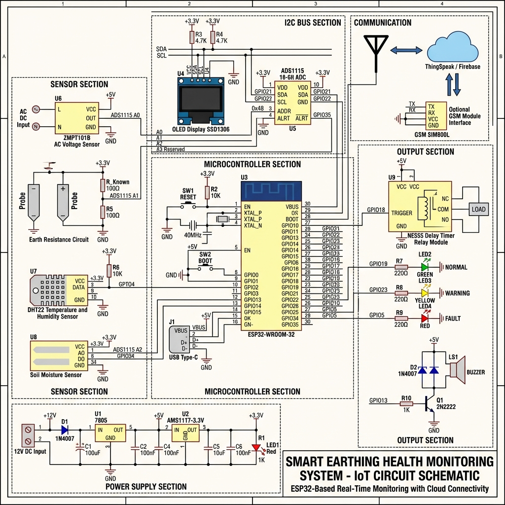
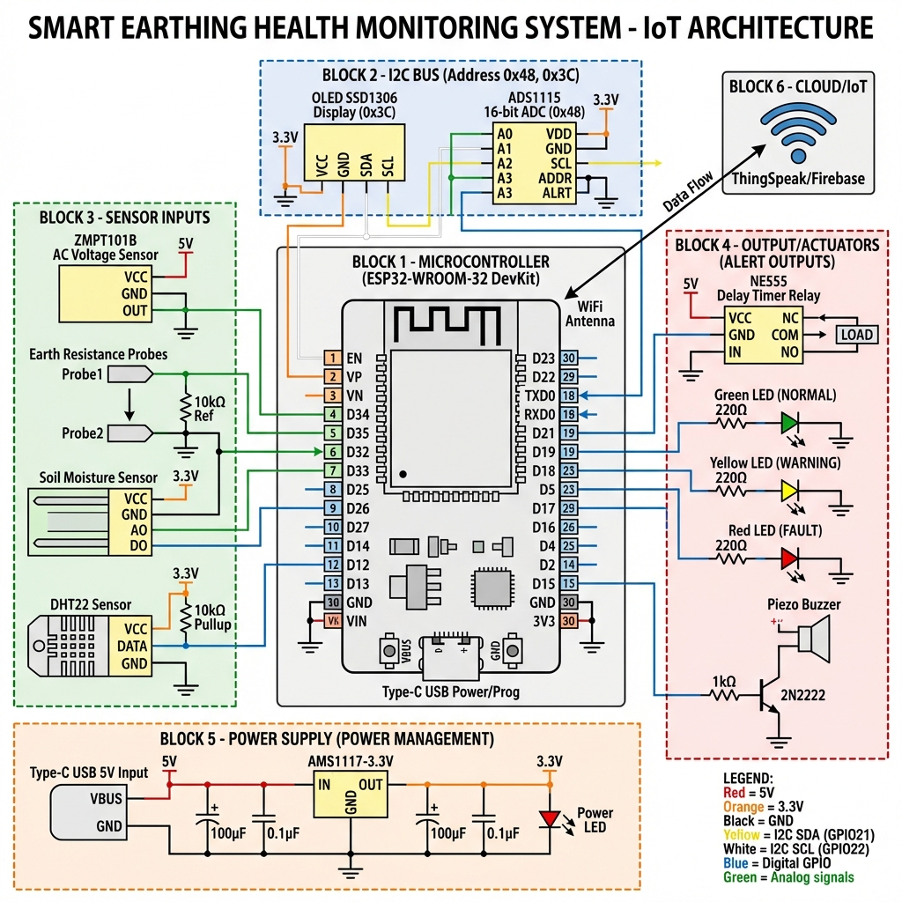
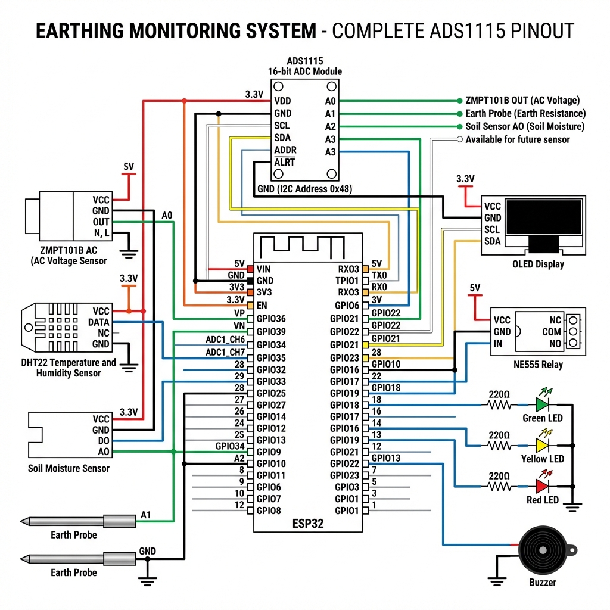

# ESP32 Earthing System Health Monitor



## 🌟 Overview

A real-time IoT-based earthing monitoring system using ESP32 microcontroller that monitors soil moisture and AC voltage to ensure proper electrical earthing. The system features a web dashboard, OLED display, and audio-visual alerts.

## ✨ Features

- **Real-time Monitoring**: Continuous monitoring of soil moisture and AC voltage
- **Web Dashboard**: Responsive web interface accessible via WiFi
- **OLED Display**: Local 128x64 OLED display showing live readings
- **Audio-Visual Alerts**: Buzzer and LED indicators for fault conditions
- **Dual-Core Processing**: ESP32's dual cores ensure responsive web server
- **Offline Operation**: Works completely offline in Access Point mode
- **Auto-Calibration**: Configurable voltage and moisture thresholds

## 📊 System Architecture



## 🔧 Hardware Components

| Component | Specification | Purpose |
|-----------|--------------|---------|
| ESP32 DevKit | Dual-core 240MHz | Main controller |
| OLED Display | SSD1306 128x64 I2C | Local display |
| Soil Moisture Sensor | Capacitive | Measures soil conductivity |
| ZMPT101B | AC Voltage Sensor | Monitors earthing voltage |
| Buzzer | Active 5V | Audio alert |
| Red LED | 5mm | Visual indicator |

## 📌 Pin Configuration

### ESP32 Pin Mapping

```
Soil Moisture:
├── Signal Pin: GPIO 34 (ADC1_CH6)
└── Power Pin: GPIO 25

ZMPT101B Voltage Sensor:
└── Signal Pin: GPIO 35 (ADC1_CH7)

OLED Display (I2C):
├── SDA: GPIO 21
└── SCL: GPIO 22

Indicators:
├── Buzzer: GPIO 26
└── Red LED: GPIO 14
```

Detailed pin configuration: [ESP32_PIN_CONFIGURATION.md](./ESP32_PIN_CONFIGURATION.md)

## 🔌 Circuit Diagram



## 🚀 Quick Start

### Prerequisites

- Arduino IDE (1.8.x or 2.x)
- ESP32 Board Support Package
- Required Libraries:
  - `Adafruit_GFX`
  - `Adafruit_SSD1306`
  - `WiFi` (built-in)
  - `WebServer` (built-in)

### Installation

1. **Clone the repository**
   ```bash
   git clone https://github.com/Dakshit06/EARTHING-SYSTEM-HEALTH-MONITORING.git
   cd EARTHING-SYSTEM-HEALTH-MONITORING
   ```

2. **Install Arduino Libraries**
   - Open Arduino IDE
   - Go to `Sketch` → `Include Library` → `Manage Libraries`
   - Search and install:
     - Adafruit GFX Library
     - Adafruit SSD1306

3. **Configure Board**
   - Board: "ESP32 Dev Module"
   - Upload Speed: 921600
   - Flash Frequency: 80MHz
   - Flash Mode: QIO
   - Flash Size: 4MB
   - Partition Scheme: Default

4. **Upload Code**
   - Open `src/ESP32_Earthing_WebServer.ino`
   - Click Upload (Ctrl+U)

## 📱 Usage

### Connecting to the System

1. **Power on ESP32**
   - OLED will show "WiFi AP Ready!"
   - Note the IP address (usually `192.168.4.1`)

2. **Connect to WiFi**
   - SSID: `Earthing_System`
   - Password: `12345678`

3. **Access Dashboard**
   - Open browser: `http://192.168.4.1`
   - Dashboard updates every second

### Dashboard Features


- ✅ Real-time soil moisture percentage
- ✅ AC voltage readings
- ✅ Earthing status (GOOD/BAD)
- ✅ Color-coded progress bars
- ✅ System configuration display

## ⚙️ Configuration

### Earthing Thresholds

Edit these values in the code to match your requirements:

```cpp
// Soil Moisture Threshold
const int SOIL_THRESHOLD = 25;  // Minimum 25%

// Voltage Range
const float VOLT_MIN = 2.50;    // Minimum 2.50V
const float VOLT_MAX = 2.75;    // Maximum 2.75V
```

### WiFi Credentials

```cpp
const char* ssid = "Earthing_System";
const char* password = "12345678";
```

## 📂 Project Structure

```
earthingproject/
├── src/ESP32_Earthing_WebServer.ino       # Main code (v3.0)
├── ESP32_Earthing_WebServer_OFFLINE.ino # Alternative offline version
├── mock_server.py                      # Python test server
├── README.md                           # This file
├── ESP32_PIN_CONFIGURATION.md          # Detailed pin guide
├── SOIL_SENSOR_GUIDE.md               # Sensor calibration guide
├── Project_Details_Proposal.pdf        # Project documentation
├── images/
│   ├── Complete_Circuit_Diagram.png
│   ├── IoT_System_Architecture.png
│   ├── Professional_IoT_Circuit_Schematic.png
│   └── dashboard_preview.png
└── test_scripts/
    ├── test_1_i2c_scanner.ino
    ├── test_2_oled.ino
    ├── test_3_ads1115.ino
    ├── test_4_buzzer_led.ino
    └── test_5_full_system.ino
```

## 🧪 Testing

### Component Tests

Run individual test scripts to verify each component:

1. **I2C Scanner** (`test_1_i2c_scanner.ino`)
   - Detects I2C devices
   - Verifies OLED address (0x3C)

2. **OLED Test** (`test_2_oled.ino`)
   - Tests display functionality
   - Shows sample text

3. **Buzzer/LED Test** (`test_4_buzzer_led.ino`)
   - Tests alert indicators
   - Verifies GPIO connections

4. **Full System Test** (`test_5_full_system.ino`)
   - Complete integration test
   - All sensors + display + alerts

### Mock Server

For testing the web interface without hardware:

```bash
python mock_server.py
```

Access at: `http://localhost:8000`

## 🔍 Troubleshooting

### Dashboard shows "CONNECTING..."

**Problem**: Web server not responding

**Solutions**:
1. Clear browser cache (Ctrl+Shift+R)
2. Try Incognito/Private mode
3. Check Serial Monitor for errors
4. Verify ESP32 is connected to power

### Continuous Beeping

**Problem**: Earthing condition not met

**Solutions**:
1. Check Serial Monitor for actual values
2. Adjust thresholds in code
3. Verify sensor connections
4. Ensure soil sensor is properly inserted

### OLED Not Working

**Problem**: Display shows nothing

**Solutions**:
1. Run I2C scanner test
2. Check SDA/SCL connections
3. Verify OLED address (0x3C)
4. Check power supply (3.3V)

## 📊 Serial Monitor Output

Expected output at 115200 baud:

```
=============================
ESP32 Earthing Monitor v3.0
ULTRA-SIMPLE DASHBOARD
=============================
AP Started!
SSID: Earthing_System
IP: 192.168.4.1
Web server started!
Dashboard: http://192.168.4.1
Web Server Task started on Core 0
Sensor Task started on Core 1
Soil: 66% | Voltage: 2.67V | Status: GOOD
Soil: 66% | Voltage: 2.68V | Status: GOOD
```

## 🌐 Cloud Integration (Optional)

For remote monitoring, integrate with ThingSpeak:

See: [thingspeak_guide.md](./docs/thingspeak_guide.md)

## 📈 Performance

- **Update Rate**: 1 second
- **Web Response**: <100ms
- **Sensor Accuracy**: ±2% (soil), ±0.01V (voltage)
- **WiFi Range**: ~30 meters (open space)
- **Power Consumption**: ~150mA @ 5V

## 🛡️ Safety Considerations

⚠️ **IMPORTANT SAFETY WARNINGS**:

1. **High Voltage**: ZMPT101B handles AC mains voltage
2. **Isolation**: Ensure proper electrical isolation
3. **Waterproofing**: Protect electronics from moisture
4. **Grounding**: Never bypass actual earthing systems
5. **Professional Installation**: Consult electrician for installation

## 🤝 Contributing

Contributions are welcome! Please:

1. Fork the repository
2. Create a feature branch (`git checkout -b feature/AmazingFeature`)
3. Commit changes (`git commit -m 'Add AmazingFeature'`)
4. Push to branch (`git push origin feature/AmazingFeature`)
5. Open a Pull Request

## 📝 License

This project is licensed under the MIT License - see the [LICENSE](LICENSE) file for details.

## 👨‍💻 Author

**Dakshit Shalev**
- GitHub: [@Dakshit06](https://github.com/Dakshit06)
- Project: [EARTHING-SYSTEM-HEALTH-MONITORING](https://github.com/Dakshit06/EARTHING-SYSTEM-HEALTH-MONITORING)

## 🙏 Acknowledgments

- Adafruit for excellent sensor libraries
- ESP32 community for documentation
- Arduino IDE team

## 📞 Support

For issues and questions:
- Open an [Issue](https://github.com/Dakshit06/EARTHING-SYSTEM-HEALTH-MONITORING/issues)
- Check [Troubleshooting](#-troubleshooting) section
- Review [Project Documentation](./Project_Details_Proposal.pdf)

## 🔄 Version History

### v3.0 (Current)
- Ultra-simple offline dashboard
- Dual-core FreeRTOS implementation
- Improved web server responsiveness
- Minified HTML/CSS/JS

### v2.0
- Added web dashboard
- WiFi Access Point mode
- Real-time updates

### v1.0
- Basic sensor monitoring
- OLED display
- Alert system

---

**⭐ If you find this project useful, please star the repository!**


